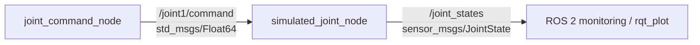

# ROS 2 Robotic Arm Simulation

Early-stage ROS 2 control, simulation, and hardware-integration work for a robotic arm project.

The project currently has two validated tracks:

1. a ROS 2 one-joint command/feedback simulation, and
2. a bench-tested ESP32 + CAN + dual-stepper hardware controller.

The long-term goal is to connect the ROS 2 control stack to the physical multi-joint robotic arm through a CAN-based hardware interface.

## Current Progress

### ROS 2

- ROS 2 Humble running on Ubuntu 22.04 / WSL
- Joint command publisher
- Simulated joint subscriber
- Command topic: `/joint1/command`
- Feedback topic: `/joint_states`
- Position and velocity feedback
- Repeating command sequence:
  `0° → 90° → -45° → 45° → 0°`
- Command and simulated position visualized with `rqt_plot`

### Hardware / CAN

- CANable 2.0 tested with SavvyCAN
- SN65HVD230 CAN transceiver connected to ESP32
- ESP32 TWAI/CAN running at **250 kbps**
- Two TB6600 stepper drivers
- Two NEMA 23 stepper motors
- Individual motor control over CAN verified
- Synchronized dual-motor motion verified
- Opposite-direction dual-motor command verified for differential/belt experiments
- Current firmware configured for **1/16 microstepping**
- Smooth cosine-interpolated acceleration/deceleration ramp
- Critical common-ground issue identified and corrected during bench testing

## System Architecture

### Current ROS 2 simulation



### Current hardware bench setup

```text
SavvyCAN
   ↓
CANable 2.0
   ↓
CAN bus
   ↓
SN65HVD230
   ↓
ESP32
   ↓
┌───────────────┬───────────────┐
│               │               │
TB6600 #1       TB6600 #2
│               │
NEMA 23 #1      NEMA 23 #2
```

### Target architecture

```text
ROS 2
  ↓
Joint command / trajectory
  ↓
CAN hardware interface
  ↓
ESP32
  ↓
Stepper drivers
  ↓
NEMA 23 motors
  ↓
Encoder feedback
  ↓
ROS 2 joint states
```

## CAN Motor-Control Milestone

The current ESP32 firmware uses standard CAN ID `0x100` at **250 kbps**.

| Data byte | Action |
|---|---|
| `01` | Motor 1, one revolution |
| `02` | Motor 2, one revolution |
| `03` | Both motors, synchronized step rate, opposite directions |
| `04` | Both motors with the opposite direction combination |

Current ESP32 pins:

```text
CAN TX        GPIO18
CAN RX        GPIO21

Motor 1 STEP  GPIO25
Motor 1 DIR   GPIO26

Motor 2 STEP  GPIO32
Motor 2 DIR   GPIO33
```

The current 1/16 microstepping configuration uses:

```text
3200 pulses/revolution
START_DELAY_US = 1200
MIN_DELAY_US   = 150
RAMP_STEPS     = 1000
```

The current maximum commanded speed is approximately **62.5 RPM**.

The firmware and wiring notes are documented in:

```text
firmware/esp32_can_dual_stepper/
```

## Important Hardware Finding

During bench testing, the motors initially locked/buzzed instead of rotating even though CAN commands were being received.

The fault was traced to a missing **common signal ground between the ESP32 and TB6600 control inputs**. The STEP/DIR inputs require a valid return/reference path.

This is now part of the required wiring configuration for the hardware controller.

## Simulated Joint Model

The current ROS 2 joint is represented by a simple first-order model:

```text
error = target_position - current_position
velocity = K × error
current_position += velocity × dt
```

or, in continuous form,

```text
θ̇ = K(θ_cmd - θ)
```

with:

- `K = 2.0`
- `dt = 0.02 s`

This produces a smooth response toward each commanded position rather than an instantaneous jump.

## Repository Structure

```text
ros2-robotic-arm-simulation/
├── firmware/
│   └── esp32_can_dual_stepper/
│       ├── esp32_can_dual_stepper.ino
│       └── README.md
├── my_first_package/
│   ├── __init__.py
│   ├── hello_node.py
│   ├── testing.py
│   └── simulated_joint.py
├── resource/
├── test/
├── package.xml
├── setup.cfg
└── setup.py
```

The current ROS 2 executables are:

- `joint_command` → `my_first_package.testing:main`
- `simulated_joint` → `my_first_package.simulated_joint:main`

## Build ROS 2 Package

Place the package inside a ROS 2 workspace, for example:

```text
~/ros2_ws/src/ros2-robotic-arm-simulation
```

Then build:

```bash
cd ~/ros2_ws
colcon build --packages-select my_first_package
source /opt/ros/humble/setup.bash
source install/setup.bash
```

## Run ROS 2 Demo

Open separate terminals and source the workspace in each one.

### 1. Start the simulated joint

```bash
source /opt/ros/humble/setup.bash
source ~/ros2_ws/install/setup.bash
ros2 run my_first_package simulated_joint
```

### 2. Start the command publisher

```bash
source /opt/ros/humble/setup.bash
source ~/ros2_ws/install/setup.bash
ros2 run my_first_package joint_command
```

### 3. Inspect the command topic

```bash
ros2 topic echo /joint1/command
```

The values are in radians:

- `90° = 1.5708 rad`
- `45° = 0.7854 rad`
- `-45° = -0.7854 rad`

### 4. Inspect joint feedback

```bash
ros2 topic echo /joint_states
```

The feedback includes joint name, position, and velocity.

## Plot Command vs. Joint Position

Install the plotting plugin if required:

```bash
sudo apt install ros-humble-rqt-plot
```

Launch it with:

```bash
ros2 run rqt_plot rqt_plot
```

Plot:

```text
/joint1/command/data
/joint_states/position[0]
```

## Useful ROS 2 Checks

```bash
ros2 node list
ros2 topic list
ros2 topic info /joint1/command
ros2 topic info /joint_states
ros2 pkg executables my_first_package
```

## Roadmap

```text
1-DOF ROS 2 command + feedback simulation
              ↓
CAN + ESP32 dual-stepper bench control        [current]
              ↓
Belt / differential mechanism characterization
              ↓
CAN command packet with angle + velocity
              ↓
Non-blocking step generation
              ↓
Encoder feedback
              ↓
7-joint simulation
              ↓
URDF + RViz
              ↓
ros2_control
              ↓
Joint trajectory controller
              ↓
MoveIt 2 motion planning
              ↓
ROS 2 ↔ CAN hardware interface
              ↓
Physical 7-DOF robotic arm
```

## Next Hardware-Control Work

The current firmware uses blocking `delayMicroseconds()` motion loops. The next controller revision should move step generation to hardware timers/RMT or another non-blocking architecture.

That will allow:

- continuous CAN reception while motors are moving
- target angle and RPM commands instead of fixed command bytes
- coordinated multi-axis motion
- immediate stop/abort handling
- encoder-based position feedback
- eventual integration with `ros2_control`

## Status

This repository is under active development. The current implementation intentionally separates simple ROS 2 concepts from bench-tested hardware control so that each layer can be validated before they are integrated into the complete robotic arm.
