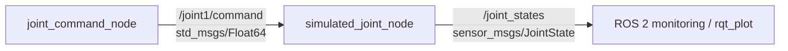

# ROS 2 Robotic Arm Simulation

Early-stage ROS 2 control and simulation work for a robotic arm project.

The current milestone focuses on one revolute joint. A ROS 2 command node publishes desired joint angles, while a second node simulates the joint response and publishes position and velocity feedback through `sensor_msgs/JointState`.

## Current Progress

- ROS 2 Humble running on Ubuntu 22.04 / WSL
- Joint command publisher
- Simulated joint subscriber
- Command topic: `/joint1/command`
- Feedback topic: `/joint_states`
- Position and velocity feedback
- Repeating command sequence:
  `0° → 90° → -45° → 45° → 0°`
- Command and simulated position visualized with `rqt_plot`

## ROS 2 Architecture



The software structure is intended to evolve toward the physical arm:

```text
ROS 2
  ↓
Joint command / trajectory
  ↓
Hardware interface
  ↓
ESP32
  ↓
Stepper driver
  ↓
NEMA 23 motor
  ↓
Encoder feedback
  ↓
ROS 2 joint state
```

## Simulated Joint Model

The current joint is represented by a simple first-order model:

```text
error = target_position - current_position
velocity = K × error
current_position += velocity × dt
```

or, in continuous form,

```text
θ̇ = K(θ_cmd - θ)
```

with:

- `K = 2.0`
- `dt = 0.02 s`

This produces a smooth response toward each commanded position rather than an instantaneous jump.

## Package Structure

```text
ros2-robotic-arm-simulation/
├── my_first_package/
│   ├── __init__.py
│   ├── hello_node.py
│   ├── testing.py
│   └── simulated_joint.py
├── resource/
├── test/
├── package.xml
├── setup.cfg
└── setup.py
```

The current executables are:

- `joint_command` → `my_first_package.testing:main`
- `simulated_joint` → `my_first_package.simulated_joint:main`

## Build

Place the package inside a ROS 2 workspace, for example:

```text
~/ros2_ws/src/ros2-robotic-arm-simulation
```

Then build:

```bash
cd ~/ros2_ws
colcon build --packages-select my_first_package
source /opt/ros/humble/setup.bash
source install/setup.bash
```

## Run

Open separate terminals and source the workspace in each one.

### 1. Start the simulated joint

```bash
source /opt/ros/humble/setup.bash
source ~/ros2_ws/install/setup.bash
ros2 run my_first_package simulated_joint
```

### 2. Start the command publisher

```bash
source /opt/ros/humble/setup.bash
source ~/ros2_ws/install/setup.bash
ros2 run my_first_package joint_command
```

### 3. Inspect the command topic

```bash
ros2 topic echo /joint1/command
```

The values are in radians:

- `90° = 1.5708 rad`
- `45° = 0.7854 rad`
- `-45° = -0.7854 rad`

### 4. Inspect joint feedback

```bash
ros2 topic echo /joint_states
```

The feedback includes:

- joint name
- position
- velocity

## Plot Command vs. Joint Position

Install the plotting plugin if required:

```bash
sudo apt install ros-humble-rqt-plot
```

Launch it with:

```bash
ros2 run rqt_plot rqt_plot
```

Plot:

```text
/joint1/command/data
/joint_states/position[0]
```

The command changes as a sequence of target positions, while the simulated joint position follows with first-order dynamics.

## Useful ROS 2 Checks

```bash
ros2 node list
ros2 topic list
ros2 topic info /joint1/command
ros2 topic info /joint_states
ros2 pkg executables my_first_package
```

## Roadmap

The current one-joint demo is the first software milestone. Planned development is:

```text
1-DOF command + feedback simulation
              ↓
7-joint simulation
              ↓
URDF robot description
              ↓
RViz visualization
              ↓
ros2_control
              ↓
Joint trajectory controller
              ↓
MoveIt 2 motion planning
              ↓
ESP32 hardware interface
              ↓
Stepper drivers + NEMA 23 motors
              ↓
Encoder feedback
              ↓
Physical 7-DOF robotic arm
```

## Status

This repository is under active development. The current implementation is intentionally simple so that ROS 2 communication, joint commands, feedback, and actuator-response concepts can be validated before moving to the complete robotic arm model and physical hardware.
